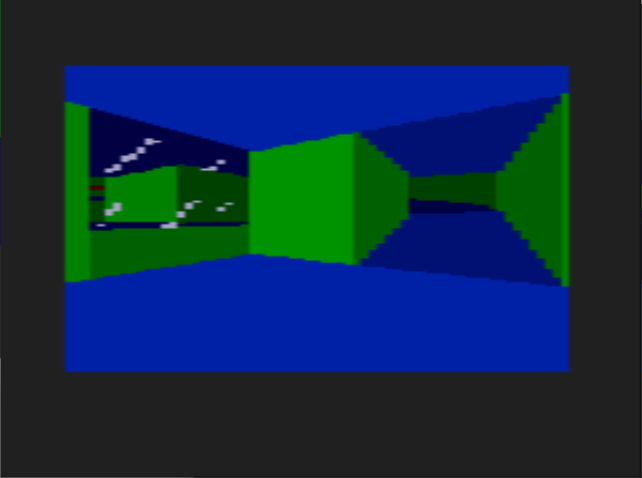

# PortalView
Portal renderer for Sega Genesis/Megadrive.

Uses a "2.5D", doom or build engine-style rendering pipeline, but with convex sectors and portals.

Graphics features
- Arbitrary angled walls, ala doom and build-engine. 
- Affine texture mapping (might be possible to get perspective without too much performance loss)
- Sector-based lighting levels (might be possible to improve this to per-column lighting)
- Sloped floors and ceilings
- Overlapping "non-euclidean" geometry
- Transparent surfaces.

