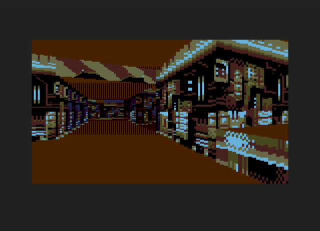

# PortalView
Portal renderer for Sega Genesis/Megadrive.

Uses a "2.5D", doom or build engine-style rendering pipeline, but with convex sectors and portals.

Graphics features
- Arbitrary angled walls, ala doom and build-engine. 
- Perspective-correct texture mapping
- Sector-based lighting levels with per-column distance lighting.
- Overlapping "non-euclidean" geometry
- Transparent surfaces.

